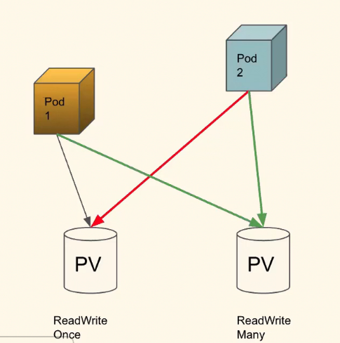

## 1) what is kubernetes KOPS?
Ans) kOps is a automation tool used to setup a kubernetes cluster instead of using kubeadmin to do it.

kOps is not something that will help you setup managed kubernetes cluster (EKS) or something but if you
intended to spin a test cluster or a small dev cluster then kOps can quickly do this.

kops will not only help you create, destroy, upgrade and maintain production-grade, highly available, Kubernetes
cluster, but it will also provision the necessary cloud infrastructure.

It support AWS, DigitalOcean, GCE, and OpenStack in beta support, and Azure and AliCloud in alpha.

## 2) Explain replication controler in kubernetes?
Ans) A replication controller is responsible for running the specified number of pod copies (replicas) across the cluster.
(it is not autoscale like on traffic it won't scale to 3-->10 for the they is HAC, for sql etc VAC)

Rc.yaml
(3 replicas)
Pod-1
Pod-2
Pod-3
~~~
apiVersion: v1
kind: ReplicationController
metadata:
name: nginx
spec:
replicas: 3
selector:
app: nginx
template:
metadata:
name: nginx
labels:
app: nginx
spec:
containers:
- name: nginx
image: nginx
ports:
- containerPort: 80
~~~

## 4) What is pv and pvc in kubernetes? what roles do they play?
Ans) **pv** is persistantVolume 
     **PVC** is persistantVolumeClam

     explaination :- pod(container need the volume )-->PVC[pod as PVC REQUEST to PV]-->PV[it is a presistant volume genarator]-->[Volume (NFS,EBS etc)]

## 5) Question : A pod is trying to access a volume but it gives access error. We would like this pod to have access to this volume, What can we do to achieve the same.   
Ans) The issue could be appear because of AccessMode of volume

    . Not all PV allow multiple pod access

In K8's
ReadWriteOnce

ReadOnlyMany

ReadWriteMany

ReadWriteOncePod

Example NFS allows **ReadWriteMany**
EBS allows only **ReadWriteonce**

## 6) Question : what is a side car container?
Ans) side car container are containers to help the applications running task to preform some common task. it makes application much smoother to deploy, automate it.

 example: getting the logs from main container and tranfer to centralized logging system.  

 ## 7) Question : We want to launch certain pods only on specific nodes. These nodes should explicitly used only for this pods. Is it possible to control the deployment of pods in such a given scenario ?

 Ans) 
Yes, This can be achieved by Taints in K8's

. We can add a taint to a node kubectl taint nodes nodex key=value:Effect

Taints are a property of nodes that push pods away if they don't tolerate this taint.

. Like Labels, one or more Taints can be applied to a node.

This means that the node must not accept any pod that does not tolerate all of these taints.

--> to achieve this kind of result we can use **Taints and tolerance** methodology in the kubernetes. especially we can use Taints is a methodolgy in which label our nodes according to our use cases because of which it will repel [all different kinds of pod we con't label but for application pod which requied need to label that matchs the Taint label hence it properly provision in specofic node]

## 8) Question: How does the K8's scheduler quickly assign worker nodes for the pods ? Explain the internal working of K8's scheduler.
Ans) basically we know Scheduler will Schedule the pods on Nodes. but we need to explain here as how Schedular works[Scheduler have the data of NODES like **[health,loads]** acording to there data it **filters,Scores** give the rank. **pod Schedular cycle** will cross-check required storage and memory then place the pod on healthy Nodes ]

## 9) Question: You have 10 nodes with 500GB of disk attached to each node. Let us say the node disk space reached 85% usage; then the pod we have deployed should get evicted and re-deployed on a node with better disk health.Explain if this can even be done?
Ans) based on question we need to save Node before reaching threshold--> we can we **Kubectl command to make eviction of pod** [eviction is on **Node level** not pod] by evicte soft and evicte hard 
~~~
kubelet \
-- eviction-hard=memory.available<500Mi,nodefs.available<10%,nodefs.inodesFree<5%,imagefs.available<15% \
-- eviction-soft=memory.available<1Gi,nodefs.available<15%,nodefs.inodesFree<10%,imagefs.available<20% \
-- eviction-soft-grace-
period=memory.available=1m30s,nodefs.available=1m30s,nodefs.inodesFree=1m30s,imagefs.available=1m30s \
-- eviction-max-pod-grace-period=60 \
-- eviction-pressure-transition-period=5m \
-- pod-manifest-path=/etc/kubernetes/manifests \
-- fail-swap-on=false \
-- hostname-override=$(hostname) \
-- node-ip =< node-ip> \
-- kubeconfig=/var/lib/kubelet/kubeconfig \
-- bootstrap-kubeconfig=/var/lib/kubelet/bootstrap-kubeconfig \
-- config=/var/lib/kubelet/config.yaml \
-- container-runtime=docker \
-- container-runtime-endpoint=unix:///var/run/docker.sock |
-- runtime-request-timeout=15m \
-- volume-plugin-dir=/usr/libexec/kubernetes/kubelet-plugins/volume/exec/ \
-- logtostderr=true \
-- V=2
~~~

