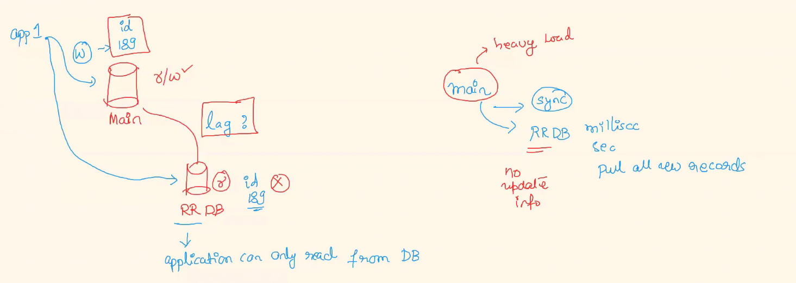

## 1) Question : what is instance fleet in AWS ?
Ans)
hour

. Specify the instance types that work best for your applications

· An EC2 Fleet contains the configuration information to launch a fleet-or group-of instances. In a single
API call, a fleet can launch multiple instance types across multiple Availability Zones, using the
On-Demand Instance, Reserved Instance, and Spot Instance purchasing options together.

Define separate On-Demand and Spot capacity targets and the maximum amount you're willing to pay per
hour 
. Specify how Amazon EC2 should distribute your fleet capacity within each purchasing option
· The instance fleet configuration for Amazon EMR clusters lets you select a wide variety of provisioning
options for Amazon EC2 instances, and helps you develop a flexible and elastic resourcing strategy for
each node type in your cluster. 

## 2) Question : What is vertical scaling and horizontal scaling. Explain with use case you have seen ?
Ans) virtical scaling and horizontal scaling are both important methodology to implement in organization
 1) **virtical scaling** : it is required when you need more **CPU,Memory and diskspace**
 2) **horizontal scaling** : it is required when you have more traffic or (increasing traffic suddenly) , ex: ASG, Replica set etc

 ## 3) Question : Could explain how you would block an IAM user from accessing a specific S3 bucket ?

. If you are thinking you can do this via IAM policy then that's a wrong answer.

. The right way to do this is via S3 bucket policy
~~~
Bucket policy
The bucket policy. writtee in JSOh, provides acceas to the abjects stared in the buacket. Bucket pollues dortt apply to sbjects awned by other accounts. Leam more 
~~~

Domain : AWS

## 4) Question : Example the below IAM policy?

"Version": "2012-10-17",
"Statement": [

"Sid": "AllowS3ListRead",
"Effect": "Allow",
"Action": [
"s3:GetBucketLocation",
"s3:GetAccountPublicAccessBlock",
"s3:ListAccessPoints",
"s3:ListAllMyBuckets"

"Resource": "arn:aws:s3 :::* "

"Sid": "AllowS3Self",
"Effect": "Allow",
"Action": "s3 :* ",
"Resource": [
"arn:aws:s3 ::: carlossalazar/*",
"arn:aws:s3 ::: carlossalazar"

]

"Sid": "DenyS3Logs",
"Effect": "Deny",
"Action": "s3 :* ",
"Resource": "arn:aws:s3 :::* log*"

}
}
]

here three high level action 2 allow 1 deny [1 : you need to perform specfic action, 2: you can perform all action with specfic bucket, 3 : it deny permission for suffix log]

## 5) what kind of DB's have you used/supported?

Databases are common in all application development
Being a DevOps engineer you don't need be a DB expert but have a clear information on what kind of DB are
used in which uses cases and pick one for your profile and experience.

Column DB   ---> casendra it is column based databases (it is super effective to store different kinds of data and very fast retival capaticity it--> semaless db )
Relation DB ---> MySQL
Key-Value DB ---> redis like k8s etcd
 NoSQL or Document db ---> mongoDB , dynamo db

 **best choose to go with MYSQL[releation db], in organization we had used rds,mariadb etc(they as expetting more information on this)

 ## 6) Question : Why do we have 3 different kind of IAM policy types ? (Managed, Customer Managed and Inline policy ? )
 ANS) 
 All these 3 kinds of policy play an important role
**Managed policy** - AWS created and maintained policy
**Customer Managed** - Customer created and managed policy
**Inline policy** - Created and attached directly to IAM User, Group or Role

 in the interview something like this. In AWS, managed policy is basically the ones that are created by AWS and are completely
managed by AWS and customer-managed policies are something that we create for our use cases. Customer-managed IAM policies are custom IAM policies that are used for our applications The inline policy has a very special use
case, meaning it gets created as part of the IAM user, group, or role.

When this group, the role, or the user gets deleted, the policy also gets deleted, that is the inline policy also gets deleted.
One other point I would like to add here is if I create a customer-managed policy, I can attach to multipe different, user, or group. but inline policy only restricted to specfic roles or user or group where it got created

## 7) Question : What is ingress and egress ? Where are these terms mostly associated ?

. Ingress --> Incoming traffic
. Egress-->  Outgoing traffic
Both these terms are aligned mostly with security groups we also called as inbound, outbound traffic, also assocated with VPC's and subnets, where we contol incomming traffic from internet and they routing the traffic between our subnets

## 8) Question : Auto Scaling group for a project is having issues with getting/provisioning new nodes. Its using complete spot instances.What could be the issue ?
ans) - Having a ASG full of only spot instance is not a good idea unless the application can support a bit of
downtime or have back up ASG also
We could have 2 major cause for this
Increase in spot price
EC2 quota limit

## 9) how is your k8s setup done on aws?
Ans) 

AWS - EKS

Many ways in which we setup K8's are
Local - Minicube
Cloud

EC2 - kops command
EC2 - kubeadmin
GCP - K8's
Production services are always look for stable env
Staging can be having a experimental setup, that's not an issue.

Helm code-->kops quick setup(dev, stage env)-->Managed EKS cluster(eks,gks,aks etc, reduced the maintains time for production)

## 10) Question : What are the load balancers in AWS. Briefly explain which one you have used and uses cases of others.
Application Load Balancer
· Path based routing, Multiple ASG balancing

Network Load Balancer
· Streaming service
· Uses network layer (TCP protocol)

Gateway Load Balancer
· GWLB Target groups support the Generic Networking Virtualization Encapsulation(GENEVE) on port: 6081 Runs within one Availability Zone(AZ)

--> in my orgainzation i am used application load balances  in most-cases,application like life-protal,elife etc, hences we are stick in application load balancer but i have also a knowledge of other load balancer like network LB, getway LB etc

## 11) Question : what is market place for AMI?

AWS Marketplace is a curated digital catalog that makes it easy for organizations to discover, procure, entitle, provision, and govern third-party software. example : Red hat, Qlikq,trend mircro

**for external softerware we need to pay both aws for EC2 instances and software cost of 3rd-pary**

## 12) what is a lag of read-replica of databases?

Ans) lag the reffering to read-replica is appear when a main DB(due to ligh load)  has gone out-of-sink(it may be 1ms or 1sec or even minutes), once the main DB is recovered from the load it automatically in-sink with read-replica DB.

## 13) Question: Are you aware of Backtrack option in AWS Aurora? How does it help?
Ans) **backtracking** is very special feature, offering by Aurora DB, it is a mini backup of DB in the window of last **72 hours** if they is mistake or rowback in last 72 hours to can do it.

### backup vs backtracking
backup: it is taking entire DB as backup up to specific time (take back up in last 24 hours)
backtracking: it can track the data for last 72 hours

