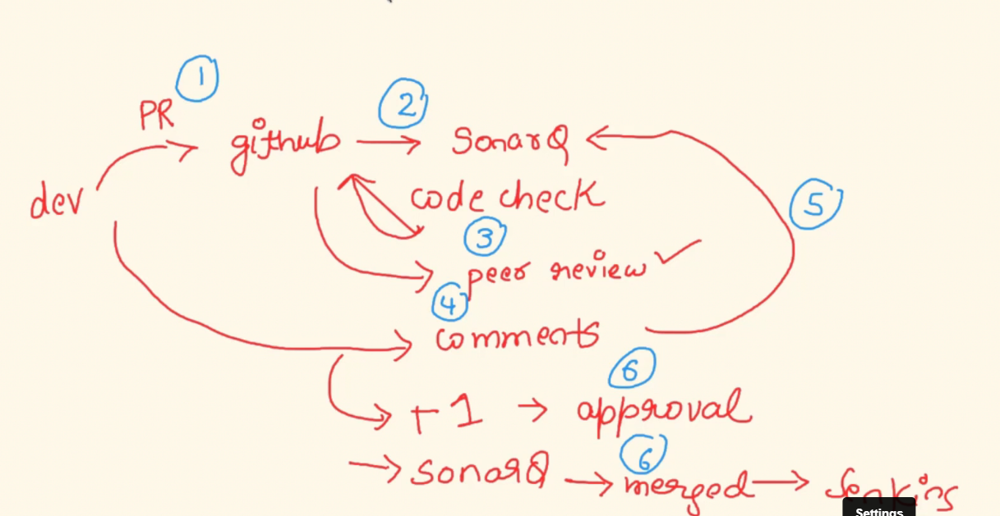

## 1) Question : How do you handle incidents in your team ? What Devops best practices you have implemented for the same ?
Ans) monitoring(cloudwatch, prometheus)--> alerting(SNS, Alertmanager)--> email, slack, phone

we have a application, in application we can expose this metrics and collecting to the monitoring system and set the rules on the logs, if rules don't meet requriement it sent the notifaction like email,phone etc

application-->metrics-->collects--> alert rules--> on call (now work on it)

after the incident (we have postmorterm) : in this we a point like (what went wrong?), how to pervent this in the future

## 2) Question : What do you think is the future trajectory towards your journey of being Devops engineer ?
Ans) I am not fully aware of x,y,z technologys, i am looking farward to solidify those technologyes in my next careers job.master the pervious tool i had learned, and keep on learning

## 3) Question : Tell me about yourself and what are you day to day task being a DevOps engineer ?
Ans) 

devops--> working with dev,tester,SRE,Sales etc
1) 9:00 to 10:00 --> I will check sack,updates on jira tickets
2) 10:00 to 10:30 --> daily standup meeting
3) 10:30 to 1:00 pm --> i am working with JIRA tickets (server issuse, ec2 instances,git reviews/code,opeartion etc)
4) 2:00 to 4:00 --> pair-decision, design-discussion etc
5) 4:00 to 5:00 --> learning new tools and technologies

## 4) Question : What is the difference between webserver and application server ?

web server is basically displaying and rendering content for front-end users but as a user we use the web-server more [lets say if you want to login or buy or something] , so there is some compution that has to be make with the help of application server [major idea is application server acts as a back-end server which does some kind of computation and pass to web servers]

user--> web server(login page, home page)---> application server [it make come kind of computations(it is also start of microservers )]-->DB
## 5) Question : Do you use sonarqube ? If yes please share why is it important. If no then share why it might not be required.
Ans) 
· SonarQube is an automatic code review tool to detect bugs, vulnerabilities, and code smells in your code

SonarQube gives you the tools you need to write clean and safe code:

SonarLint - SonarLint is a companion product that works in your editor giving immediate feedback
so you can catch and fix issues before they get to the repository.

Quality Gate - The Quality Gate lets you know if your project is ready for production.

Clean as You Code - Clean as You Code is an approach to code quality that eliminates a lot of the
challenges that come with traditional approaches. As a developer, you focus on maintaining high
standards and taking responsibility specifically in the New Code you're working on.

Issues - SonarQube raises issues whenever a piece of your code breaks a coding rule, whether it's
an error that will break your code (bug), a point in your code open to attack (vulnerability), or a
maintainability issue (code smell).

Security Hotspots - SonarQube highlights security-sensitive pieces of code that need to be
reviewed. Upon review, you'll either find there is no threat or you need to apply a fix to secure the
code.

