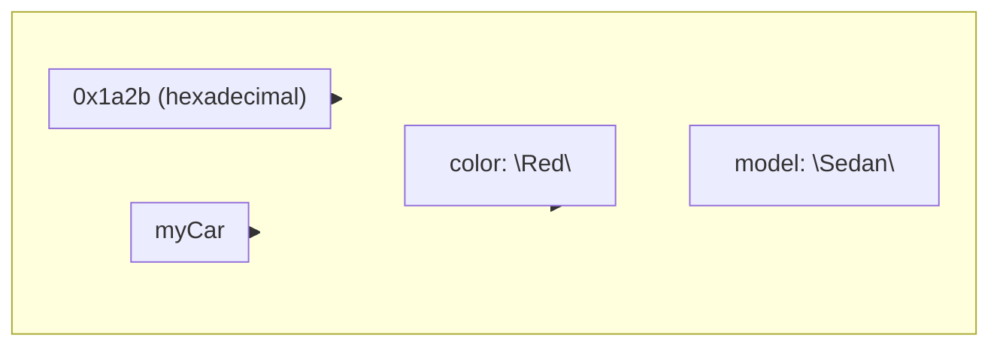
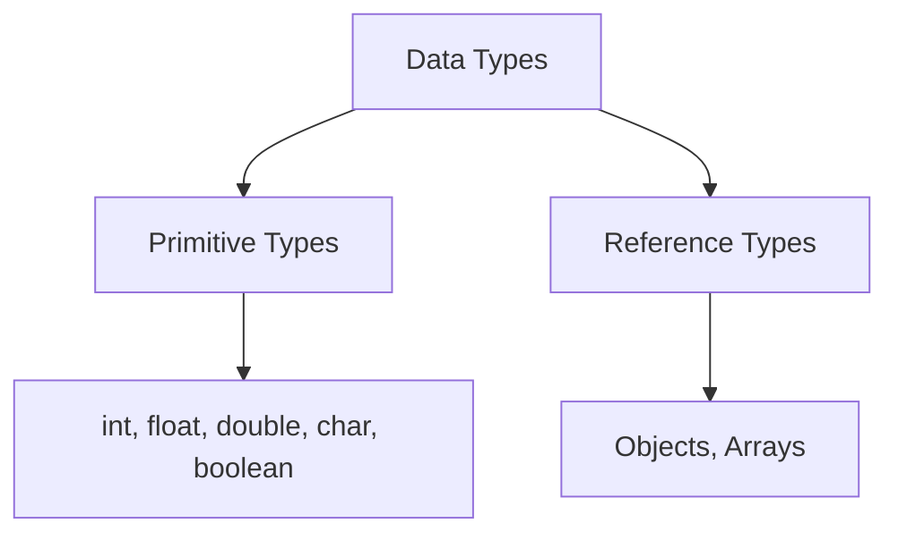
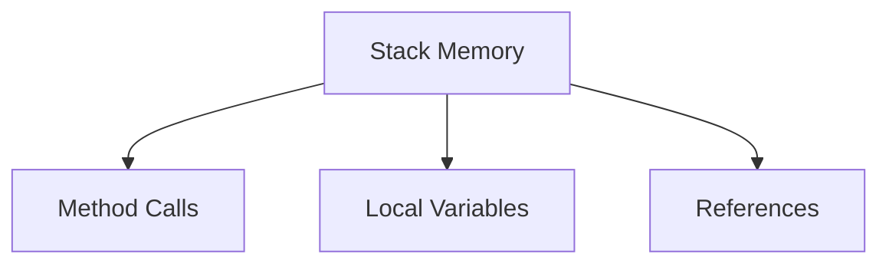
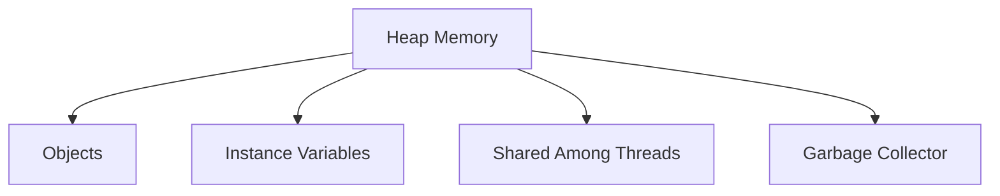
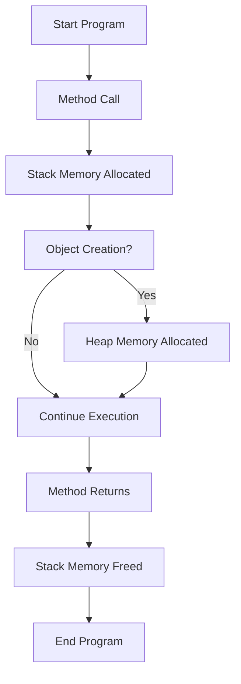
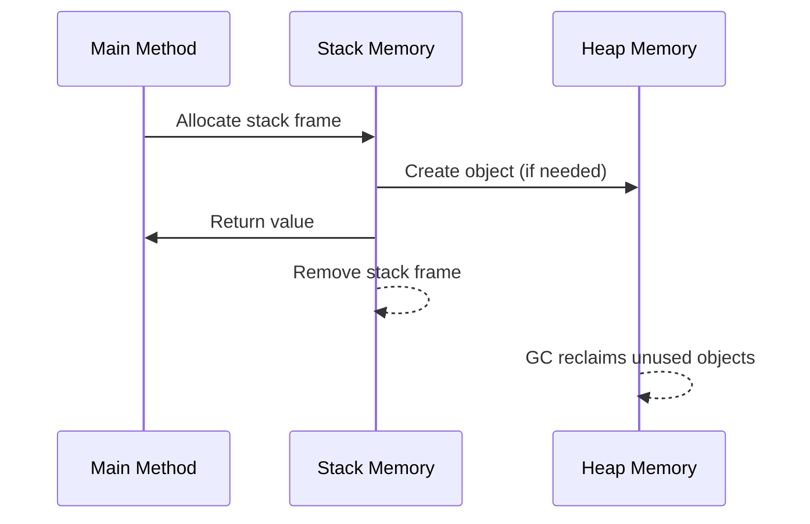
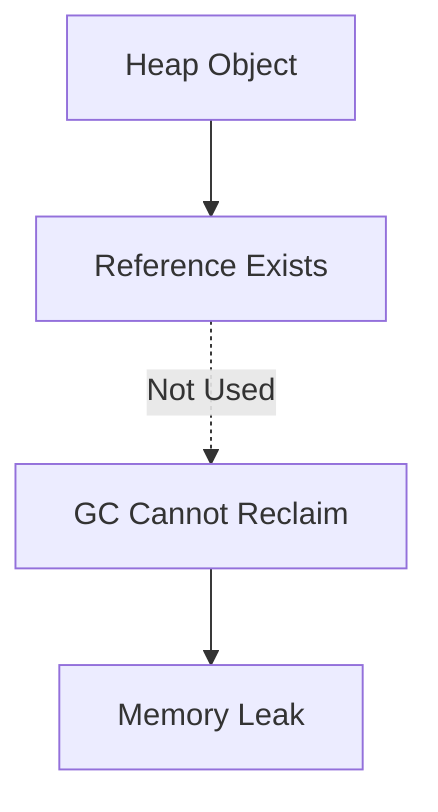

# Java: Data Types, Heap Memory, Stack Memory, and Memory Leakage

Java manages memory using two main areas: **heap memory** and **stack memory**. Understanding how these work is crucial for writing efficient and leak-free programs.

---

## Data Types in Java

Java supports several data types, which are stored in memory as binary (often represented in hexadecimal for readability):

- **Primitive Types:** `int`, `float`, `double`, `char`, `boolean`, etc.
- **Reference Types:** Objects, arrays, etc.

Each data type has a defined size and behavior.

~~~ Java
Car myCar = new Car();
    myCar.color = "Red";
    myCar.model = "Sedan";
~~~
- myCar = address of object
- we we call the color, model with object then this data stored in object of heap memory 
**Visualization: Object in Heap Memory**

- The large box represents the object in heap memory.
- The small box at the top-left shows the object's hexadecimal address.
- The small box at the right shows the object name (`myCar`).
- Inside the box, the object's fields (`color` and `model`) are shown.

**Diagram: Data Types**

**Learn more:**  
- [Java Data Types (Oracle Docs)](https://docs.oracle.com/javase/tutorial/java/nutsandbolts/datatypes.html)

---

## Memory Areas

### Stack Memory

- Stores method calls, local variables, and references.
- Follows Last-In-First-Out (LIFO) principle.
- Memory is automatically freed when a method exits.

**Diagram: Stack Memory**

**Learn more:**  
- [Java Stack Memory (GeeksforGeeks)](https://www.geeksforgeeks.org/stack-memory-in-java/)

### Heap Memory
(heap memory is used to store the obj/var, if GC didn't clean the unresured memory is call the leaked memory)
- Stores objects and their instance variables.
- Shared among all threads.
- Garbage Collector (GC) reclaims unused objects.

**Diagram: Heap Memory**

**Learn more:**  
- [Java Heap Memory (GeeksforGeeks)](https://www.geeksforgeeks.org/heap-memory-in-java/)

---

## Internal Workflow Diagram

**Learn more:**  
- [Java Memory Management (Oracle Docs)](https://docs.oracle.com/javase/specs/jvms/se7/html/jvms-2.html#jvms-2.5.4)

---

## Detailed Internal Workflow

1. **Program starts**: The main method is called, and stack memory is allocated for its execution.
2. **Method calls**: Each method call creates a new stack frame for local variables and references.
3. **Object creation**: When `new` is used, memory for the object is allocated on the heap.
4. **Reference storage**: The reference to the heap object is stored in the stack frame.
5. **Method returns**: The stack frame is removed, and local variables are lost.
6. **Garbage Collection**: If no references to a heap object remain, the GC reclaims its memory.

**Diagram: Internal Workflow**

**Learn more:**  
- [Java Memory Management (Baeldung)](https://www.baeldung.com/java-memory-management)

---

## Memory Leakage

Memory leakage occurs when objects in the heap are no longer needed but are still referenced, preventing the GC from reclaiming their memory. This can lead to increased memory usage and potential application crashes.

**Diagram: Memory Leakage**

**Learn more:**  
- [Memory Leaks in Java (Baeldung)](https://www.baeldung.com/java-memory-leaks)

---

**Summary:**  
Understanding the distinction between stack and heap memory, and how Java manages them, helps prevent memory leaks and ensures efficient program execution.

## note

- JVM is used to store object refferences values to heap memory (Car myCar = new Car()--> JVM --> myCar.color = "Red"(INSIDE HEAP MEMORY))
- default constructor are generated by compiler not by JVM
- **new** new Car() : new is the instruction to JVM  to allocate the heap memory to object.
