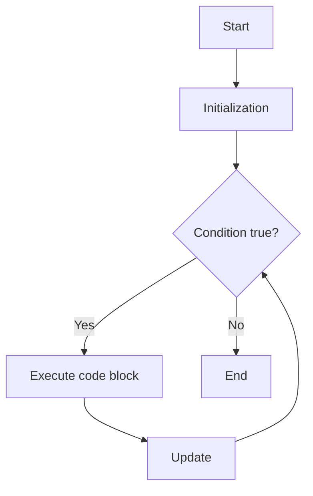
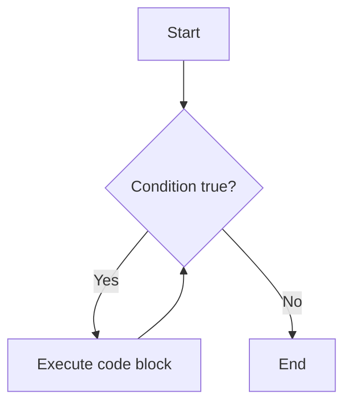
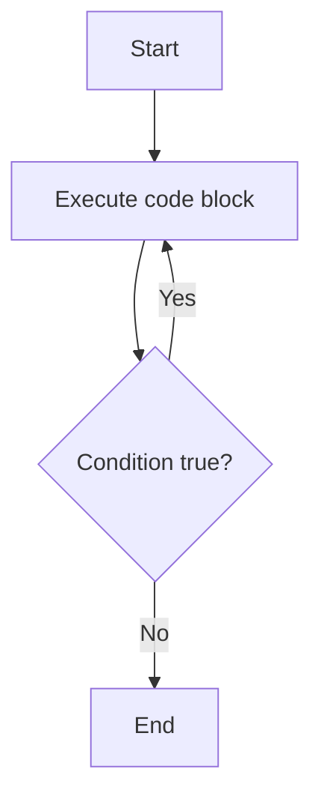

# Java Loops

Loops in Java are used to execute a block of code repeatedly as long as a specified condition is true. There are several types of loops in Java:
### types
1) for loops
2) while loops
3) for-each loops
4) do-while loops

## 1. `for` Loop

The `for` loop is used when the number of iterations is known.

**Syntax:**
```java
for (initialization(1); condition(2); update/incremention(4)) {
    // code block to be executed (3)
}
```
- from the **for** keyword it start and followed by intialization and then condition check, if the codition is **True** then the control goes for statement exeution, after successfull exeutation of statement the control goes for increment & decrement value and comes back for condition check and cycle repeats. if condition failed the loop terminate's

**Example:**
```java
for (int i = 1; i <= 5; i++) {
    System.out.println(i);
}
```
~~~
public class mobile {
    static void call() {
        int number = 99480;
        int count = 0;

        for(int a=1;number > 0;number /= 10) {  // Proper condition to process digits
            count += number % 10; // Extract last digit and add to count
        }

        System.out.println("Sum of the digits: " + count);
    }

    public static void main(String[] args) {
        mobile.call();
    }
}
~~~
- **Output**
~~~
Sum of the digits: 30
~~~
## Control Loop Flowchart

### For Loop Flowchart


## 2. `while` Loop

The `while` loop is used when the number of iterations is not known and depends on a condition.

**Syntax:**
```java
while (condition) {
    // code block to be executed
}
```

**Example:**
```java
int i = 1;
while (i <= 5) {
    System.out.println(i);
    i++;
}
```
~~~
public class mobile {
    static void call() {
        int number = 99480;
        int count = 0;

        while (number > 0) {  // Proper condition to process digits
            count += number % 10; // Extract last digit and add to count
            number /= 10; // Remove last digit
        }

        System.out.println("Sum of the digits: " + count);
    }

    public static void main(String[] args) {
        mobile.call();
    }
}
~~~
- **Output**
~~~
Sum of the digits: 30
~~~
## Control Loop Flowchart
### While Loop Flowchart


- while loop alway starts from the keyword and followed by a boolean codition(boolean) return **True** then control goes for statement execution
- After sucessfull, it continous the loop util the condition **False** or **Failed**

## 3. `do-while` Loop

The `do-while` loop is similar to the `while` loop, but it executes the code block at least once.

**Syntax:**
```java
do {
    // code block to be executed
} while (condition);
```

**Example:**
```java
int i = 1;
do {
    System.out.println(i);
    i++;
} while (i <= 5);
```
## Control Loop Flowchart
### Do-While Loop Flowchart


## Summary Table

| Loop Type   | Use Case                        | Condition Checked | Minimum Executions |
|-------------|---------------------------------|-------------------|--------------------|
| for         | Known number of iterations      | Before loop       | 0                  |
| while       | Unknown number of iterations    | Before loop       | 0                  |
| do-while    | At least one execution required | After loop        | 1                  |

