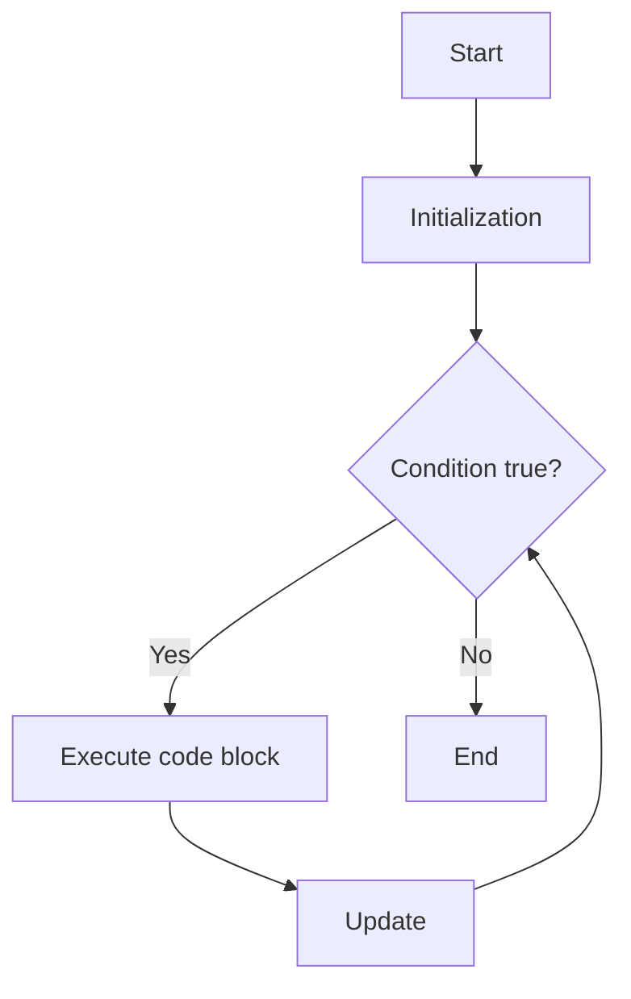
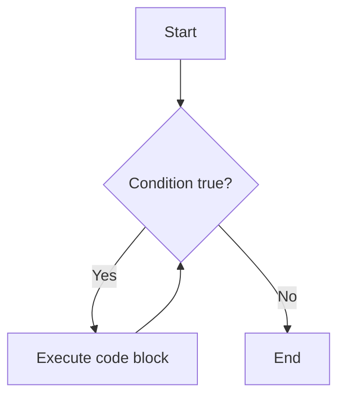
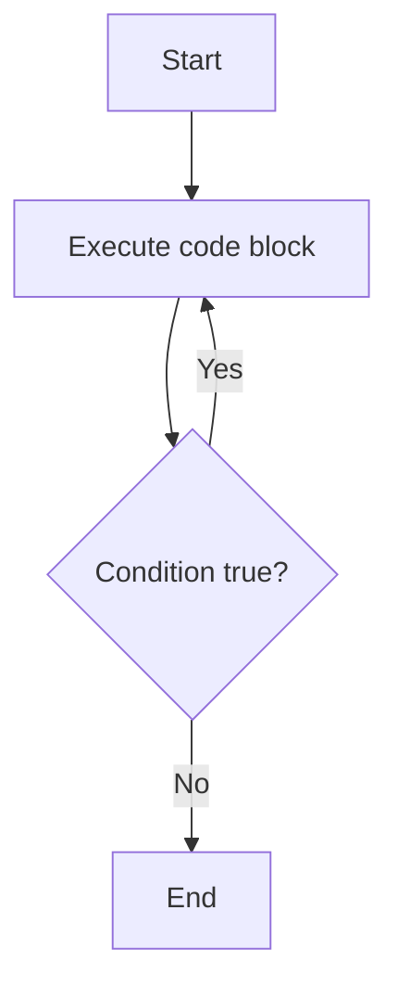

# Java Loops

Loops in Java are used to execute a block of code repeatedly as long as a specified condition is true. There are several types of loops in Java:

## 1. `for` Loop

The `for` loop is used when the number of iterations is known.

**Syntax:**
```java
for (initialization; condition; update) {
    // code block to be executed
}
```

**Example:**
```java
for (int i = 1; i <= 5; i++) {
    System.out.println(i);
}
```

## 2. `while` Loop

The `while` loop is used when the number of iterations is not known and depends on a condition.

**Syntax:**
```java
while (condition) {
    // code block to be executed
}
```

**Example:**
```java
int i = 1;
while (i <= 5) {
    System.out.println(i);
    i++;
}
```

## 3. `do-while` Loop

The `do-while` loop is similar to the `while` loop, but it executes the code block at least once.

**Syntax:**
```java
do {
    // code block to be executed
} while (condition);
```

**Example:**
```java
int i = 1;
do {
    System.out.println(i);
    i++;
} while (i <= 5);
```

---

## Control Loop Flowcharts

### For Loop Flowchart



### While Loop Flowchart



### Do-While Loop Flowchart



---

## Summary Table

| Loop Type   | Use Case                        | Condition Checked | Minimum Executions |
|-------------|---------------------------------|-------------------|--------------------|
| for         | Known number of iterations      | Before loop       | 0                  |
| while       | Unknown number of iterations    | Before loop       | 0                  |
| do-while    | At least one execution required | After loop        | 1                  |